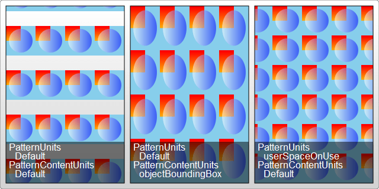
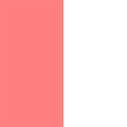
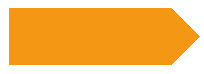

# 1. 教程 (Tutorial)

[link](https://cloud.tencent.com/developer/section/1423865)

## 1.1 Basic Shapes (基本形状)

```svg
<svg width="200" height="250" version="1.1" xmlns="http://www.w3.org/2000/svg">
  <rect x="10" y="10" width="30" height="30" stroke="black" fill="transparent" stroke-width="5"/>
  <rect x="60" y="10" rx="10" ry="10" width="30" height="30" stroke="black" fill="transparent" stroke-width="5"/>
  <circle cx="25" cy="75" r="20" stroke="red" fill="transparent" stroke-width="5"/>
  <ellipse cx="75" cy="75" rx="20" ry="5" stroke="red" fill="transparent" stroke-width="5"/>
  <line x1="10" x2="50" y1="110" y2="150" stroke="orange" stroke-width="5"/>
  <polyline points="60 110 65 120 70 115 75 130 80 125 85 140 90 135 95 150 100 145"
            stroke="orange" fill="transparent" stroke-width="5"/>
  <polygon points="50 160 55 180 70 180 60 190 65 205 50 195 35 205 40 190 30 180 45 180"
           stroke="green" fill="transparent" stroke-width="5"/>
  <path d="M20,230 Q40,205 50,230 T90,230" fill="none" stroke="blue" stroke-width="5"/>
</svg>
```

### 矩形 - Rectangles

`rect`元素会在屏幕上绘制一个矩形。只需要6个基本属性就可以控制它在屏幕上的位置和形状。其中 `rx ry`属性用来控制圆角。如果没有设置圆角，则默认为0 。所以最基本的属性是：`x y width height`。

```svg
<rect x="10" y="10" width="30" height="30"/>
<rect x="60" y="10" rx="10" ry="10" width="30" height="30"/>
```

| 属性名 | 描述                   |
| ------ | ---------------------- |
| x      | 矩形左上角的 x 位置    |
| y      | 矩形左上角的 y 位置    |
| width  | width 矩形的宽度       |
| height | height 矩形的高度      |
| rx     | rx 圆角的 x 方位的半径 |
| ry     | ry 圆角的 y 方位的半径 |

### 圆形 - Circle

`circle`元素会在屏幕上绘制一个圆形。它只需要3个属性来设置。

```svg
<circle cx="25" cy="75" r="20"/>
```

| 属性名 | 描述            |
| ------ | --------------- |
| r      | 圆的半径        |
| cx     | 圆心的 x 轴位置 |
| cy     | 圆心的 y 轴位置 |

### 椭圆 - Ellipse

`ellipse`是 `circle`元素更通用的形式，你可以分别缩放圆的 x 半径和 y 半径。（通常数学上称之为长轴半径和短轴半径）

```svg
<ellipse cx="75" cy="75" rx="20" ry="5"/>
```

| 属性 | 描述              |
| ---- | ----------------- |
| rx   | 椭圆的 x 半径     |
| ry   | 椭圆的 y 半径     |
| cx   | 椭圆中心的 x 位置 |
| cy   | 椭圆中心的 y 位置 |

### 线条 - Line

`line`绘制直线。它取两个点的位置作为属性，指定这条线的起点和终点位置。

```svg
<line x1="10" x2="50" y1="110" y2="150"/>
```

| 属性 | 描述          |
| ---- | ------------- |
| x1   | 起点的 x 位置 |
| y1   | 起点的 y 位置 |
| x2   | 终点的 x 位置 |
| y2   | 终点的 y 位置 |

### 折线 - Polyline

`polyline`是一组连接在一起的直线。因为它可以有很多的点，折线的所有点位置都放在一个 points 属性中：

```svg
<polyline points="60 110, 65 120, 70 115, 75 130, 80 125, 85 140, 90 135, 95 150, 100 145"/>
```

| 属性   | 描述                                                         |
| ------ | ------------------------------------------------------------ |
| points | 点集数列。每个数字用空白，逗号，终止命令符或者换行符分隔开。每个点必须包含2个数字，一个是x坐标，一个是y坐标。所以点列表(0,0), (1,1), (2,2) 可以写成这样："0 0, 1 1, 2 2" |

### 路径 - Path

`path`可能是 SVG 中最常见的形状。你可以用 `path`元素绘制矩形（直角矩形或者圆角矩形），圆形，椭圆，折线，多边形，以及一些其他的形状，例如贝塞尔曲线，2次曲线等。后续章节会详细介绍，这里只介绍一下定义路径形状的属性。

```svg
<path d="M 20 230 Q 40 205, 50 230 T 90230"/>
```

| 属性 | 描述     |
| ---- | -------- |
| d    | 点集数列 |

## 1.2 Basic Transformations (基本转型)

### 元素集合 - Group

在对形状进行变形前，先介绍一下 `g`元素。利用它可以把属性赋给一整个元素集合。

```svg
<svg width="30" height="10">
  <g fill="red">
    <rect x="0" y="0" width="10" height="10" />
    <rect x="20" y="0" width="10" height="10" />
  </g>
</svg>
```

接下来所有的变形都会用一个元素的 `transform`属性。**变形可以连续，只需要把它们连接起来并用空格隔开即可。**

### 平移 - translate

`translate()`变形方法可以把元素移动一段距离，甚至可以根据相应的属性定位它。

```svg
<svg width="40" height="50" style="background-color:#bff;">
  <rect x="0" y="0" width="10" height="10" transform="translate(30,40)" />
</svg>
```

该示例将一个矩形移到点(30, 40)，而不是出现的点(0, 0)。

`translate(x, y = 0)`如果没有指定第二个值(y)，它默认被赋值为0

### 旋转 - rotate

`rotate()`	变形方法用来旋转一个元素。

```svg
<svg width="31" height="31">
  <rect x="12" y="-10" width="20" height="20" transform="rotate(45)" />
</svg>
```

该示例显示了一个方形，旋转了45度。

`rotate(angle)`使用的值单位是角度。

### 斜切 - skewX, skewY

可以用 `skewX()`和 `skewY()`变形将一个矩形制作成一个斜菱形。

```svg
<rect x="0" y="0" width="10" height="10" transform="skewX(45)" />
<rect x="0" y="10" width="10" height="10" transform="skewY(45)" />
```

### 缩放 - scale

`scale()`变形用来改变元素的尺寸。它需要两个数字，作为比率计算如何缩放。0.5 表示收缩到 50%。

```svg
<rect x="0" y="0" width="10" height="10" transform="scale(0.5,0.5)" />
<rect x="0" y="0" width="10" height="10" transform="scale(0.5)" />
```

`scale(sx, sy?)` 如果第二个数字被忽略，它默认等于第一个值。

### 用 `matrix()` 实现复杂变形

所有有上面的变形可以表达为一个 2x3 的变形矩阵。组合一些变形，可以直接用 `matrix(a, b, c, d, e, f)`变形设置结果矩阵。

本质上是利用矩阵把上一个坐标系的坐标映射到了新的坐标系统。

```svg
<rect x="10" y="10" width="30" height="20" fill="red"
      transform="matrix(3 1 -1 3 30 40)" />
<!--
[a c e]    [3 -1 30]
[b d f] => [1  3 40]
[0 0 1]    [0  0  1]
-->
```

|                          |                                                              |
| ------------------------ | ------------------------------------------------------------ |
| 左上角 (oldX=10 oldY=10) | newX = a * oldX + c * oldY + e = 3 * 10 - 1 * 10 + 30 = 50; newY = b * oldX + d * oldY + f = 1 * 10 + 3 * 10 + 40 = 80 |
| 右上角 (oldX=40 oldY=10) | newX = 3 * 40 - 1 * 10 + 30 = 140; newY = 1 * 40 + 3 * 10 + 40 = 110 |
| 左下角 (oldX=10 oldY=30) | newX = 3 * 10 - 1 * 30 + 30 = 30; newY = 1 * 10 + 3 * 30 + 40 = 140 |
| 右下角 (oldX=40 oldY=30) | newX = 3 * 40 - 1 * 30 + 30 = 120; newY = 1 * 40 + 3 * 30 + 40 = 170 |

### 坐标系统上的效果

如果使用了变形，你会在元素内部建立一个新的坐标系统，应用了这些变形，你为该元素和它的子元素指定的单位可能不是 1:1 像素映射。但是依然会根据这个变形进行歪曲，斜切，转换，缩放操作。

```svg
<svg width="100" height="100">
  <g transform="scale(2)">
    <rect width="50" height="50" />
  </g>
</svg>
```

该示例中矩形将是 100x100px，如果使用了比如说 `userSpaceOnUse`等属性，将出现更吸引人的效果。

### SVG 嵌在 SVG 内部

SVG 允许无缝嵌入别的 `svg`元素。因此可以利用内部的 `svg`元素的属性 `viewBox, width, height`简单创建一个新的坐标系统

```svg
<svg xmlns="http://www.w3.org/2000/svg" version="1.1" width="100" height="100">
  <svg width="100" height="100" viewBox="0 0 50 50">
    <rect width="50" height="50" />
  </svg>
</svg> 
```

该示例也将显示一个 100x100px 的矩形。

## 1.3 Clipping and masking (剪切和掩蔽)

去掉已经创建的元素的部分内容，最初看起来有点矛盾。但是如果打算在 SVG 中创建一个半圆形，将发现下面的属性的作用。

**Clipping**用来移除在别处定义的元素的部分内容。在这里，任何半透明效果都是不行的。它只能要么显示要么不显示。

**Masking**允许使用透明度和灰度值遮罩计算得到的软边缘。

### 创建剪切

在一个圆形的基础上创建一个半圆形：

```svg
<svg>
  <defs>
    <clipPath id="cut-off-bottom">
      <rect x="0" y="0" width="200" height="100" />
    </clipPath>
  </defs>

  <circle cx="100" cy="100" r="100" clip-path="url(#cut-off-bottom)" />
</svg>
```

在(100,100)位置创建一个半径为100的圆形。它的属性 `clip-path`引用了一个带单个 `rect`元素的 `clipPath`元素，此时在它的内部将会使用这个矩形把画布的上半部分涂黑。(注意，`clipPath`元素经常放在一个 `defs`元素内。)

然而，这个矩形并不会被绘制，它的像素数据将被用来确定圆形的哪些像素需要最终呈现出来。因为矩形只覆盖了圆形的上半部分，所以圆形的下半部分将消失。

此时我们就有了一个半圆形，并且并不用处理弧形路径元素。对于剪切，`clipPath`内部的每个路径（在该示例中只有一个矩形）都会被检查到，与它的描边属性一起被估值，变形。它们的颜色，透明度并不会影响最终呈现的效果。

### 遮罩

遮罩的效果最令人印象深刻的是它表现为一个渐变的样子。如果想要让一个元素淡出，可以利用遮罩效果实现这一点。

```svg
<svg width="200" height="200">
  <defs>
    <linearGradient id="gradient">
      <stop offset="0" stop-color="white" stop-opacity="0" />
      <stop offset="1" stop-color="white" stop-opacity="1" />
    </linearGradient>
    <mask id="mask">
      <rect x="0" y="0" width="200" height="200" fill="url(#gradient)" />
    </mask>
  </defs>

  <rect x="0" y="0" width="200" height="200" fill="green" />
  <rect x="0" y="0" width="200" height="200" fill="red" mask="url(#mask)" />
</svg>
```

有一个绿色填充的矩形在底层，一个红色填充的矩形在上层。后者有一个 `mask`属性指向一个 `mask`元素。`mask`元素的内容是一个单一的 `rect`元素，它填充了一个从透明到白色的渐变。红色矩形将继承 `mask`内容（渐变）的 `alpha`值（透明度）的结果，最终将看到一个从绿色到红色渐变的输出。

### 用 `opacity`定义透明度

有一个简单的方法可以用来为整个元素设置透明度，`opacity`它的取值范围为0-1.

```svg
<rect x="0" y="0" width="100" height="100" opacity=".5" />
```

上面的矩形将绘制为半透明。还有两个分开的属性 `fill-opacity`和 `stroke-opacity`，分别用来控制填充和描边的不透明度。注意，描边将绘制在填充的上面。因此，如果在元素上设置了一个描边透明度的同时它还有填充色，则填充将会从描边的背景处透出来显示（描边宽度一半是盖在元素图形上的）。

```svg
<svg width="200" height="200">
  <rect x="0" y="0" width="200" height="200" fill="blue" />
  <circle cx="100" cy="100" r="50" stroke="yellow" stroke-width="40" stroke-opacity=".5" fill="red" />
</svg>
```

该示例中，红色的圆形在蓝色的背景上，黄色描边设置为 50% 透明度，便得有了双色描边的效果。

### 使用广为人知的 CSS 技术

Web 开发中有一个很有用的工具：`display:none`。在 SVG 上依然可以使用该 CSS 属性，连同 CSS2 定义的 `visibility`和 `clip`属性。

所有 SVG 元素的初始 `display`值都是 `inline`。

## 1.4 Fills and Strokes (填充和描边)

现在你可以用你掌握的知识来绘制任何图形了，下一个目标是给它们着色，包括指定对象的属性，使用内联 CSS 样式，或者内嵌的 CSS 样式，或者使用外部的 CSS 样式文件。大多数的 web 网站的 SVG 使用的是内联样式 CSS，对于这些方法都有优缺点。

### Fill 和 Stroke 属性

#### 上色

大多数基本的涂色可以通过在元素上设置两个属性来搞定：`fill`和 `stroke`属性。`fill`属性设置对象内部的颜色，`stroke`属性设置绘制对象的线条的颜色。你可以使用在 HTML 中的 CSS 颜色命名方案定义它们的颜色，比如说颜色名（像red这种），rgb值（像rgb(255,0,0)这样），十六进制值（#FF0000），rgba值（rgba(255,0,0,1)），等等。

```svg
<rect x="10" y="10" width="100" height="100" stroke="blue" fill="purple" fill-opacity="0.5" stroke-opacity="0.8" />
```

此外，在 SVG 中你可以分别定义填充色和边框色的不透明度，属性 `fill-opacity`控制填充色的不透明度，属性 `stroke-opacity`控制描边的不透明度。

> 注意：FireFox 3+ 支持 rgba 值，并且能够提供同样的效果。但是为了在其他浏览器中保持兼容，最好将它和填充/描边的不透明度分开使用。如果同时指定了rgba值和填充/描边不透明度，它们将都被调用。(即，`<rect fill="rgba(255,0,0,0.5)" fill-opacity="0.3" />`表示填充色透明度为0.5 * 0.3 = 0.15)

#### 描边

除了颜色属性，还有其他一些属性来控制绘制描边的方式。

```svg
<svg width="160" height="140" xmlns="http://www.w3.org/2000/svg" version="1.1">
  <line x1="40" x2="120" y1="20" y2="20" stroke="black" stroke-width="20" stroke-linecap="butt"/>
  <line x1="40" x2="120" y1="60" y2="60" stroke="black" stroke-width="20" stroke-linecap="square"/>
  <line x1="40" x2="120" y1="100" y2="100" stroke="black" stroke-width="20" stroke-linecap="round"/>
</svg>
```

`stroke-width`属性定义了描边的宽度。注意，描边是以路径为中心线绘制的，路径的每一侧都有均匀分布的描边。

第二个影响描边的属性是 `stroke-linecap`属性，它控制边框终点的形状。

`stroke-linecap`属性的值有三种可能值：

- `butt`：用直边结束线段，它是常规做法，线段边界90度垂直于描边的方向，贯穿它的终点。
- `square`：效果差不多，但是会稍微超出实际路径的范围，超出的大小由 `stroke-width`控制。
- `round`：表示边框的终点是圆角，圆色的半径也是由 `stroke-width`控制的。

还有一个 `stroke-linejoin`属性，用来控制两条描边线段之间，用什么方式连接。

```svg
<polyline points="40 60 80 20 120 60" stroke="black" stroke-width="20"
          stroke-linecap="butt" fill="none" stroke-linejoin="miter"/>
<polyline points="40 140 80 100 120 140" stroke="black" stroke-width="20"
          stroke-linecap="round" fill="none" stroke-linejoin="round"/>
<polyline points="40 220 80 180 120 220" stroke="black" stroke-width="20"
          stroke-linecap="square" fill="none" stroke-linejoin="bevel"/>
```

每条折线都是由两个线段连接起来的，连接处的样式由 `stroke-linejoin`属性控制，它有三个可用的值，`miter`是默认值，表示用方形画笔在连接处形成尖角，`round`表示用圆角连接，实现平滑效果。最后还有一个值 `bevel`，连接处会形成一个斜接。

最后，你可以通过指定 `stroke-dasharray`属性，将虚线类型应用在描边上。

```svg
<path d="M 10 75 Q 50 10 100 75 T 190 75" stroke="black"
      stroke-linecap="round" stroke-dasharray="5,10,5" fill="none"/>
<path d="M 10 75 L 190 75" stroke="red"
      stroke-linecap="round" stroke-width="1" stroke-dasharray="5,5" fill="none"/>
```

## 1.5 Filter effects (过滤器)

原链接缺少内容，故这里使用[chokcoco 关于 SVG 滤镜](https://github.com/chokcoco/cnblogsArticle)的内容。

### 有意思！强大的 SVG 滤镜

#### SVG 滤镜的种类

SVG 滤镜包括了：

- feBlend - 混合模式滤镜
- feColorMatrix - 颜色转换矩阵滤镜
- feComponentTransfer
- feComposite - 一个原始的过滤器，定义像素图像交互方式
- feConvolveMatrix
- feDiffuseLighting - 光照滤镜（散射光源）
- feDisplacementMap - 映射置换滤镜
- feFlood
- feGaussianBlur - 模糊滤镜
- feImage
- feMerge - 多滤镜叠加
- feMorphology - 形态滤镜
- feOffset - 位移滤镜
- feSpecularLighting - 光照滤镜（镜面反射光）
- feTile
- feTurbulence - 湍流滤镜（噪声）
- feDistantLight
- fePointLight
- feSpotLight

#### SVG 滤镜的语法

我们需要使用 `<defs>`和 `<filter>`标签来定义一个 SVG 滤镜。

通常所有的 SVG 滤镜元素都需要定义在 `<defs>`标记内。

> 基本上现代浏览器，即使不使用 `<defs>`包裹 `<filter>`，也能够定义一个 SVG 滤镜。

这个 `<defs>`标记是 definitions 这个单词的缩写，可以包含很多种其它标签，包括各种滤镜。

其次，使用 `<filter>`标记用来定义 SVG 滤镜。·`<filter>`标签需要一个 id 属性，它是这个滤镜的标志。SVG 图形使用这个 id 来引用滤镜。

看一个简单的 DEMO 1.5.1:

```html
<div class="cssFilter"></div>
<div class="svgFilter"></div>
<svg>
  <defs>
    <filter id="blur">
      <feGaussianBlur in="SourceGraphic" stdDeviation="5" />
    </filter>
  </defs>
</svg>
```

```css
div {
  width: 100px;
  height: 100px;
  background: #000;
}
.cssFilter {
  filter: blur(5px);
}
.svgFilter {
  filter: url(#blur);
}
```

我们在 `defs`的 `filter`标签内，使用了 SVG 的 `feGaussianBlur`滤镜，也就是模糊滤镜，它有两个属性 `in`和 `stdDeviation`。其中 `in="SourceGraphic"`属性指明了模糊效果要应用于整个图片，`stdDeviation`属性定义了模糊的程度。最后，在 CSS 中，使用 `filter: url(#blur)`去调用在 HTML 中定义的 id 为 `blur`的滤镜。

为了方便理解，也使用了 CSS 滤镜 `filter: blur(5px)`实现了一个类似的滤镜。

#### CSS filter 的 url 模式

上面的例子中使用了 `filter: url(#blur)`这种模式引入了一个 SVG 滤镜效果，url 是 CSS 滤镜属性的关键字之一，`url`模式是 CSS 滤镜提供的能力之一，允许我们引入特定的 SVG 过滤器，这极大的增强了 CSS 中滤镜的能力。

相当于所有通过 SVG 实现的滤镜效果，都可以快速的通过 CSS 滤镜 URL 模式引入。

#### 多个滤镜搭配工作

和 CSS 滤镜一样，SVG 滤镜也支持多个滤镜搭配混合使用。

先来看一个例子 1.5.2:

```html
<div></div>
<svg>
  <defs>
    <!-- Filter declaration -->
    <filter id="MyFilter">
      <!-- offsetBlur -->
      <feGaussianBlur in="SourceAlpha" stdDeviation="5" result="blur" />
      <feOffset in="blur" dx="10" dy="10" result="offsetBlur" />
      <!-- merge SourceGraphic + offsetBlur -->
      <feMerge>
        <feMergeNode in="offsetBlur" />
        <feMergeNode in="SourceGraphic" />
      </feMerge>
    </filter>
  </defs>
</svg>
```

```css
div {
  width: 200px;
  height: 200px;
  background: url(img);
  filter: url(#MyFilter);
}
```

CSS 往往一行就能实现的事情，SVG 看上去使用了很多代码。但是这个效果其实并不是简单的 CSS 中的阴影，因为它的效果是类似 PNG 图片的轮廓阴影。

##### 分解步骤

首先看这一段：

```html
<!-- offsetBlur -->
<feGaussianBlur in="SourceAlpha" stdDeviation="5" result="blur" />
<feOffset in="blur" dx="10" dy="10" result="offsetBlur" />
```

这一段会生成一个模糊效果，但有一个区别 `in="SourceAlpha"`表示利用的是原始输入中的非透明部分（alpha）。另外这里多了一个新的属性 `result='blur'`，它表明将滤镜作用的效果通过 `result`产生一个指定名称的中间结果（也称为 primitives 图元），其他滤镜可以使用 `in`属性导入不同滤镜产出的 `result`并继续操作。

紧接着，`<feOffset>`滤镜则使用 `in`拿到了上一步的结果 `result='blur'`，然后做了一个简单的位移。

合并起来就是一个非常重要的知识点：**在不同滤镜中利用 `result`和 `in`属性，可以实现在前一个基本变换操作上进行另一个操作。**比如上面例子中的先添加模糊然后进行位移效果。

这一步做完其实就获得了一个偏移了(10,10)的，黑色边缘模糊的阴影。

在实际效果中还出现了原图，所以这里接下使用 `<feMerge>`标签进行了合并：

```html
<!-- merge SourceGraphic + offsetBlur -->
<feMerge>
  <feMergeNode in="offsetBlur" />
  <feMergeNode in="SourceGraphic" />
</feMerge>
```

至此，基本上就掌握了 SVG 滤镜的工作原理，及多个滤镜如何搭配使用。接下来，只需要搞懂不同的滤镜能产生什么样的效果，有什么不同的属性，就能大致对 SVG 滤镜有个基本的掌握了！

#### 关于 SVG 滤镜还需要知道的

##### 滤镜标签通用属性

有一些属性是每一个滤镜标签都有的：

| 属性          | 作用                                                         |
| ------------- | ------------------------------------------------------------ |
| x, y          | 提供左上角的坐标来定义在哪里渲染滤镜效果。（默认值：0）      |
| width, height | 绘制滤镜容器框的高宽（默认都为 100%）                        |
| result        | 用于定义一个滤镜效果的输出名字，以便将其用作另一个滤镜效果的输入。 |
| in            | 指定滤镜效果的输入源，可以是某个滤镜导出的 `result`，也可以是下面 6 个值。 |

##### in 属性的 6 个取值

| `in` 取值       | 作用                                                         |
| --------------- | ------------------------------------------------------------ |
| SourceGraphic   | 图形元素自身将作用 `<filter>`的原始输入。                    |
| SourceAlpha     | `SourceAlpha`与 `SourceGraphic`具有相同的规则除了 `SourceAlpha`只使用元素的非透明部分。 |
| BackgroundImage | 与 `SourceGraphic`类似，但可在背景上使用。需要显式设置。     |
| BackgroundAlpha | 与 `SourceAlpha`类似，但可在背景上使用。需要显式设置。       |
| FillPaint       | 将其放置在无限平面上一样使用填充油漆。                       |
| StrokePaint     | 将其放在无限平面上一样使用描边绘画。                         |

#### feBlend 滤镜

`<feBlend>`为混合模式滤镜，与 CSS 中的混合模式相类似。

在 CSS 中，有混合模式 `mix-blend-mode`和 `background-blend-mode`。参考链接：

- [不可思议的混合模式 mix-blend-mode](https://github.com/chokcoco/iCSS/issues/16)
- [不可思议的混合模式 background-blend-mode](https://github.com/chokcoco/iCSS/issues/31)
- [CSS 奇思妙想 -- 使用 background 创造各种美妙的背景](https://github.com/chokcoco/iCSS/issues/84)

SVG 中的混合模式各类比 CSS 中的要少一些，只有 5 个，其作用与 CSS 混合模式完全一致：

- normal - 正常
- multiply - 正片叠底
- screen - 滤色
- darken - 变暗
- lighten - 变亮

简单的一个 DEMO 1.5.3，使用两张图片，利用不同的混合模式，可以得到不一样的混合结果：

```html
<div class="lighten"></div>

<svg>
  <defs>
    <filter id="lighten" x="0" y="0" width="200" height="200">
      <feImage width="200" height="200" xlink:href="/image1.jpg" result="img1" />
      <feImage width="200" height="200" xlink:href="/image2.jpg" result="img2" />
      <feBlend mode="lighten" in="img1" in2="img2" />
    </filter>
  </defs>
</svg>
```

```css
.lighten {
  width: 200px;
  height: 200px;
  filter: url(#lighten);
}
```

#### feColorMatrix 滤镜

`<feColorMatrix>`滤镜也是 SVG 滤镜中非常有意思的一个滤镜，顾名思义，它的名字中包含了矩阵这个单词，表示该滤镜基于转换矩阵对颜色进行变换。每个像素的颜色值（一个表示为(红，绿，蓝，透明度)的矢量）都经过矩阵乘法（matrix multiplated）计算出新的颜色。

`<feColorMatrix>`滤镜有 2 个私有属性 `type`和 `values`，type 它支持 4 种不同的类型，其中部分与 CSS Filter 中的一些滤镜效果类似。

| `type`类型       | 作用                     | `values`的取值范围                 |
| ---------------- | ------------------------ | ---------------------------------- |
| saturate         | 转换图像饱和度           | 0.0 - 1.0                          |
| hueRotate        | 转换图像色相             | 0.0 - 360.0                        |
| luminanceToAlpha | 阿尔法通道亮度           | 只有一个效果，无需改变 values 的值 |
| matrix           | 使用矩阵函数进行色彩变换 | 需要应用一个 4 x 5 的矩阵          |

前三个属性 saturate | hueRotate | luminanceToAlpha 的效果示意 Demo 1.5.4

saturate, hueRotate 滤镜和 CSS 中的 filter 的 saturate, hue-rotate 的作用是一模一样的。

#### feColorMatrix 中的 type=matrix

`feColorMatrix`中的 `type=matrix`理解起来要稍微更复杂点，它的 `values`需要传入一个 4X5 的矩阵。

像这样：

```html
<filter id="colorMatrix">
	<feColorMatrix type="matrix" values="1 0 0 0 0, 0 1 0 0 0, 0 0 1 0 0, 0 0 0 1 0" />
</filter>
```

要理解如何运用矩阵，就不得不直面另外一个问题 - 图像的表示。

数字图像的本质是一个多维矩阵。在图像显示时，我们把图像的 R 分量放进红色通道里，B 分量放进蓝色通道里，G 分量放进绿色通道里。经过一系列处理，显示在屏幕上的就是我们所看到的彩色图像了。

而 `feColorMatrix`中的 matrix 矩阵，就是用来表示不同通道的每一个分量的值，最终通过计算得到我们熟知的 `rgba()`值。

计算逻辑为：

```js
/* R G B A 1 */
   1 0 0 0 0 // R = 1*R + 0*G + 0*B + 0*A + 0
   0 1 0 0 0 // G = 0*R + 1*G + 0*B + 0*A + 0
   0 0 1 0 0 // B = 0*R + 0*G + 1*B + 0*A + 0
   0 0 0 1 0 // A = 0*R + 0*G + 0*B + 1*A + 0
```

Demo 1.5.5

到目前为止，大部分 SVG 滤镜的展示讲解都是 CSS 现有能力能够实现的，那 SVG 滤镜的独特与魅力到底在哪呢？有什么是 CSS 能力无法做到的么？下面来看看另外几个有意思的 SVG 滤镜。

#### feSpecularLighting/feDiffuseLighting 光照滤镜

- feDiffuseLighting: 来自外部光源，适合模拟太阳光或者灯光照明
- feSpecularLighting: 指定从反射面反射的二次光

Demo 1.5.6

#### feMorphology 滤镜

`feMorphology`为形态滤镜，它的输入源通常是图形的 alpha 通道，它有两个操作可以使源图形腐蚀（变薄）或扩张（加粗）。

它有二个主要属性：

- operator: `erode`腐蚀模式，`dilate`为扩张模式，默认为 `erode`。
- radius: 笔触的大小，接受一个数字，表示该模式下的效果程度，默认为 0.

先将这个滤镜简单的应用到文字上看看效果1.5.7：

```html
<div class="g-text">
  <p>Normal Text</p>
  <p class="dilate">Normal Text</p>
  <p class="erode">Normal Text</p>
</div>

<svg>
  <defs>
    <filter id="dilate">
      <feMorphology in="SourceAlpha" result="DILATED" operator="dilate" radius="3" />
    </filter>
    <filter id="erode">
      <feMorphology in="SourceAlpha" result="ERODE" operator="erode" radius="1" />
    </filter>
  </defs>
</svg>
```

```css
p {
  font-size: 64px;
}
.dilate {
  filter: url(#dilate);
}
.erode {
  filter: url(#erode);
}
```

当然，该滤镜也可以应用在图片上，此时就并非是简单的让图像的笔触变精或者变细了。

- 对于 `erode`模式，会将图片的每一个像素向更暗更透明的方向变化。
- 对于 `dilate`模式，则是将每个像素向周围附近更亮更不透明的方向变化。

动画 DEMO 1.5.8

#### feTurbulence 滤镜

turbulence 意为湍流，不稳定气流，而 `<feTurbulence>`滤镜能够实现半透明的烟熏或波状图像。通常用于实现一些特殊的纹理。滤镜利用 Perlin 噪声函数创建了一个图像。噪声在模拟云雾效果时非常有用，能产生非常复杂的质感，利用它可以实现人造纹理比如说云纹，大理石纹的合成。

有了 `<feTurbulence>`就可以使用 SVG 创建纹理图形作为置换图，而不需要借助外部图形的纹理效果就可以创建复杂的图形效果。

它有三个属性需要特别注意：

- type: 实现的滤镜的类型，可选 `fractalNoise`分形噪声，或者是 `turbulence`湍流噪声。
  - fractalNoise: 分形噪声更加的平滑，它产生的噪声质感更接近云雾。
  - turbulence: 湍流噪声。
- baseFrequency: 表示噪声函数的基本频率的参数，频率越小，产生的图形越大。频率越大，产生的噪声越复杂其图形也越小越精细，通常的取值范围在 0.02 - 0.2
- numOctaves: 表示噪声函数的精细度，数值越高，产生的噪声越详细。默认值为 1.

两种噪声的代码基本一致，只是 `type`类型不同：Demo 1.5.9

另外 `baseFrequency`允许传入两个值，让我们可以只改变某一方向上的频率。

`<feTurbulence>`滤镜一般是作为纹理或者输入，和其他滤镜一起搭配使用以实现一些效果。

#### 使用 feTurbulence 滤镜实现文字流动的效果

首先，尝试与文字相结合。Demo 1.5.10

```html
<filter id="fractal">
  <feTurbulence type="fractalNoise" baseFrequency="0.03" numOctaves="1" result="turbu" />
  <feDisplacementMap in="SourceGraphic" scale="50" />
</filter>
```

#### feDisplacementMap 映射置换滤镜

上面的 Demo 中还使用了 `feDisplacementMap`滤镜。

它是用于改变元素和图形的像素位置的。该滤镜通过遍历原图形的所有像素点，并重新映射到一个新的位置，产生一个新的图形。

在上面的 Demo 中，我们通过 `feTurbulence`噪声得到了噪声图形，然后通过 `feDisplacementMap`滤镜根据 `feTurbulence`所产生的噪声图形进行形变，扭曲，液化，得到最终的效果。（注：`feDisplacementMap`默认会将上一个图形作为自己的 `in2`值，所以其实效果等于是 `<feDisplacementMap in="sourceGraphic" in2="turbu" scale="50" />`）

该滤镜的转化公式为：

```
P'(x,y) ← P(x + scale * (XC(x, y) - 0.5), y + scale * (YC(x, y) - 0.5))
```

#### 使用 feTurbulence 滤镜实现褶皱纸张的纹理

接下来继续使用 feTurbulence 滤镜，使用这个滤镜我们可以生成各种不同的纹理，可以尝试使用 feTurbulence 滤镜搭配光照滤镜实现褶皱的纸张纹理效果

Demo 1.5.11

#### 使用 feTurbulence 滤镜实现按钮 hover 效果

Demo 1.5.12

#### 使用 feTurbulence 滤镜实现云彩效果

最后，使用 `feTurbulence`滤镜模拟出真实的云彩效果。

首先，通过随机生成的多重 `box-shadow`实现一个图形。（也可以由 JavaScript, SASS 等有循环能力的语言去生成）

紧接着，通过 `feTurbulence`产生分形噪声图形，使用 `feDisplacementMap`进行映射置换，最后给图形叠加上这个滤镜效果。

## 1.6 Getting Started (入门)

一个简单的 svg 例子：

```html
<svg
     version="1.1"
     baseProfile="full"
     width="300"
     height="200"
     xmlns="http://www.w3.org/2000/svg"
     >
  <rect width="100%" height="100%" fill="red" />
  <circle cx="150" cy="100" r="80" fill="green" />
  <text x="150" y="125" font-size="60" text-anchor="middle" fill="white">SVG</text>
</svg>
```

整个 SVG 的渲染过程涉及以下内容：

1. 从 `svg`根元素开始：
   - 为其他类型的验证标识 SVG 的版本，应始终使用 `version`和 `baseProfile`属性。
   - 作为 XML 方言，SVG 必须始终在正确的绑定名称空间（`xmlns`属性）。
2. 通过绘制 `rect`覆盖整个图像区域的矩形将背景设置为红色。
3. `circle`在红色矩形的中心处绘制一个半径为80像素的绿色圆圈。
4. 文本“SVG”被绘制。每个字母的内部都用白色填充。通过将锚点设置在我们想要的中点位置来定位文本。在上面的例子中，将中点指定为绿色圆圈的中心位置，按字体大小对垂直位置进行了微调。

### SVG 文件的基本属性

- 首先要注意的是元素渲染的顺序。SVG 文件的全局有效规则是，后面的元素在之前的元素上面被渲染。元素越后面越可见。
- 网络上的 SVG 文件可以直接在浏览器中显示或通过多种方法嵌入到 HTML 文件中：
  - 如果 HTML 是 XHTML 并按类型提供 `application/xhtml+xml`，则 SVG 可以直接嵌入到 XML 源中。
  - 如果 HTML 是 HTML5，并且浏览器是符合 HTML5 的浏览器，则 SVG 也可以直接嵌入。但是，可能会出现符合 HTML5 规范的语法更改。
  - SVG 文件可以用一个 `object`元素引用：`<object data="image.svg" type="image/svg+xml" />`
  - `<iframe src="image.svg"></iframe>`
  - 理论上也可以使用 `img`元素引用 SVG ，不过在 FireFox 4.0 之前不可用。
  - 最后，也可以使用 JavaScript 动态创建 SVG 并将其插入到 HTML DOM 树中。一般通过这种方法为那些无法处理 SVG 的浏览器提供替代方案。

### SVG 文件类型

SVG 文件有两种风格。普通的 SVG 文件是包含 SVG 标记的简单文本文件。这些文件的推荐文件扩展名是“.svg“（全部小写）。

由于 SVG 文件在用于某些应用程序（如地理应用程序）时文件大小可能会非常大。因此 SVG 规范还允许使用 gzip 压缩的 SVG 文件。这些文件的推荐文件扩展名是“.svgz“（全部小写）。不幸的是，由于 Firefox 无法从本地计算机加 gzip 压缩的 SVG，所以应避免使用 gzip 压缩的 SVG，除非发布到网络服务器，参考下一节。

### Webservers

对于普通的 SVG 文件，服务器应该发送的 HTTP 头文件为：

```
Content-Type: image/svg+xml
Vary: Accept-Encoding
```

对于 gzip 压缩的 SVG 文件，服务器应该发送的 HTTP 头文件为：

```
Content-Type: image/svg+xml
Content-Encoding: gzip
Vary: Accept-Encoding
```

## 1.7 Gradients (渐变 - 线性)

SVG 中并非只能简单填充颜色和描边，还可以创建并在填充和描边上应用渐变色。

有两种类型的渐变：线性渐变和径向渐变。你**必须**给渐变内容指定一个 `id`属性，否则文档内的其他元素就不能引用它。为了让渐变能被重复使用，渐变内容需要定义在 `<defs>`标签内容，而不是定义在形状上。

### 线性渐变

线性渐变沿着直线改变颜色，要插入一个线性渐变你需要在 SVG 的 `defs`元素内，创建一个 `<linearGradient>`节点。

```svg
<svg width="120" height="240">
  <defs>
    <linearGradient id="Gradient1">
      <stop class="stop1" offset="0%" />
      <stop class="stop2" offset="50%" />
      <stop class="stop3" offset="100%" />
    </linearGradient>
    <linearGradient id="Gradient2" x1="0" x2="0" y1="0" y2="1">
      <stop offset="0%" stop-color="red" />
      <stop offset="50%" stop-color="black" stop-opacity="0" />
      <stop offset="100%" stop-color="blue" />
    </linearGradient>
  </defs>

  <rect id="rect1" x="10" y="10" rx="15" ry="15" width="100" height="100" />
  <rect x="10" y="120" rx="15" ry="15" width="100" height="100" fill="url(#Gradient2)" />
</svg>
```

```css
#rect1 {
  fill: url(#Gradient1);
}
.stop1 {
  stop-color: red;
}
.stop2 {
  stop-color: black;
  stop-opacity: 0;
}
.stop3 {
  stop-color: blue;
}
```

以上是一个应用了线性渐变的 `<rect>`元素的示例。线性渐变内部有几个 `<stop>`结点，这些结点通过指定位置的 `offset`（偏移）属性和 `stop-color`（颜色中值）属性来说明在渐变的特定位置上应该是什么颜色。可以直接指定这两个属性值，也可以通过 CSS 来指定他们的值。在该示例中指明了渐变开始颜色为红色，到中间位置时变成半透明的黑色，最后变成蓝色。你可以根据需求插入很多中间颜色，但是偏移量应该始终从 0% 开始（或者0也可以），到 100%（或1）结束。如果 `stop`设置的 offset 有重合，将使用 XML 树中较晚设置的值。而且类似填充和描边，你也可以指定 `stop-opacity`来设置某个位置的不透明度。

使用渐变时，需要在一个对象的 `fill`或 `stroke`属性中引用它，这跟在 CSS 中使用 `url`引用元素的方法一样。在本例中，我们已经给一个渐变指定了一个 ID - "Gradient1"。想要引用它，只需要将属性 `fill`设置为 `url(#Gradient1)`即可，也可以用同样的方式来处理 `stroke`。

`<linearGradient>`元素还需要一些其他的属性值，它们指定了渐变的大小和出现范围。渐变的方向可以通过两个点来控制，它们分别是属性 `x1, x2, y1, y2`，这些属性定义了渐变路线走向。渐变色默认是水平方向，但是通过修改这些属性，就可以旋转该方向，如 Gradient2 就创建了一个垂直渐变：

```svg
<linearGradient id="Gradient2" x1="0" x2="0" y1="0" y2="1" />
```

注意：你也可以在渐变上使用 `xlink:href`属性，如果使用了该属性，一个渐变的属性和颜色中值可以被另一个渐变包含引用。如下，可以让 Gradient2 不再需要重新创建与 Gradient1 相同的颜色中值了。

```svg
<linearGradient id="Gradient1">
	<stop id="stop1" offset="0%" />
  <stop id="stop2" offset="50%" />
  <stop id="stop3" offset="100%" />
</linearGradient>
<linearGradient id="Gradient2" x1="0" x2="0" y1="0" y2="1" xmlns:xlink="http://www.w3.org/1999/xlink" xlink:href="#Gradient1" />
```

### 径向渐变

径向渐变与线性渐变相似，只是它是从一个点开始发散绘制渐变。创建径向渐变需要在文档的 `defs`中添加一个 `radialGradient`元素。

```html
<svg width="120" height="240">
  <defs>
    <radialGradient id="RadialGradient1">
      <stop offset="0" stop-color="red" />
      <stop offset="100%" stop-color="blue" />
    </radialGradient>
    <radialGradient id="RadialGradient2" cx="0.25" cy="0.25" r="0.25" xlink:href="#RadialGradient1" />
  </defs>

  <rect x="10" y="10" rx="15" ry="15" width="100" height="100" fill="url(#RadialGradient1)" />
  <rect x="10" y="120" rx="15" ry="15" width="100" height="100" fill="url(#RadialGradient2)" />
</svg>
```

`stop`的使用方法与之前一致，`<radialGradient>`元素有多个属性来描述其位置和方向，但它更加复杂，本质上径向渐变也是通过两个点来定义其边缘位置的。

第一点定义了渐变结束所围绕的圆环，它需要一个中心点，由 `cx, cy`属性及半径 `r`来定义。通过设置这些点可以移动渐变范围并改变它的大小。

第二个点被称为焦点，由 `fx, fy`属性定义，它用来描述渐变的中心位置。

### 中心和焦点

Demo 1.7.2

如果焦点被移动到圆圈的外面，渐变将不能正确呈现，所以该点会被假定在圆圈范围内。如果没有给出焦点，将认为该点与中心点的位置一致。

### spreadMethod

`spreadMethod`属性用来控制当前渐变到达终点的行为，这个属性可以有三个值：`pad, reflect, repeat`。`pad`就是默认效果，即当渐变到达终点时，最终的偏移颜色被用于填充对象剩下的空间。`reflect`会让渐变一直持续下去，不过它的效果是与渐变本身相反的。`repeat`也会让渐变继续，但是它不会像 `reflect`那样反向渐变，而是跳回到最初的颜色然后继续渐变。

Demo 1.7.3

### gradientUnits

两种渐变都有一个叫做 `gradientUnits`（渐变单元）的属性，它描述了渐变的大小和方向的单元系统。该属性有两个值：`userSpaceOnUse, objectBoundingBox`。

默认值为 `objectBoundingBox`，它大体上定义了对象的渐变大小范围，只需要指定 0 到 1 的坐标值，渐变就会自动的缩放到对象相同大小。

`userSpaceOnUse`则使用绝对单元，此时你必须知道对象的具体位置，并将渐变放在同样的地位置上才行，所以 `rdialGradient`需要改成如下形式：

```svg
<radialGradient id="Gradient1" cx="60" cy="60" r="50" fx="35" fy="35" gradientUnits="userSpaceOnUse">
```

## 1.8 Other content in SVG (SVG 中的其他内容)

除了图形原件，如矩形和圆形之外，SVG 还提供了一些元素用来在图片中嵌入别的类型的内容。

### 嵌入光栅图像

很像在 HTML 中的 `img` 元素，SVG 有一个 `image`元素，用于同样的目的。你可以利用它嵌入任意光栅（以及矢量）图像。它的规格要求应用至少支持PNG，JPG和SVG格式文件。

嵌入的图像变成了一个普通的 SVG 元素。这意味着你可以在其内容上进行剪切，遮罩，滤镜，旋转以及其他 SVG 工具。

```svg
<svg width="200" height="200">
  <image x="90" y="-65" width="128" height="100" transform="rotate(45)" xlink:href="/image1.jpg"/>
</svg>
```

### 嵌入任意 XML

因为 SVG 是一个 XML，所以你总是可以在 SVG 文档的任何位置嵌入任意的 XML。在 SVG 中添加了 `<foreignObject>`元素。它的唯一目的是作为其他标记的容器和 SVG 样式属性的载体（可以使用 `width`和 `height`来定义该元素占用的空间）。

如果你有很长的文本，使用 HTML 布局比 SVG 的 `text`元素更适合时，就可以使用 `foreignObject`元素将 XHTML 内容嵌入到 SVG 中。

另外使用 MathML 写的方程式也是一个经常被引用的例子。

最后，因为 `foreignObject`是一个 SVG 元素，所以它也可以像图像那样，可以将 SVG 的所有工具都应用到上面。

## 1.9 Paths (路径)

`<path>`元素是 SVG 基本形状中最强大的一个，它不仅能创建其他基本形状，还能创建更多自定义形状。

另外，`path`只需要设定很少的点，就可以创建平滑流畅的线条（比如曲线）。虽然 `polyline`元素也能实现类似的效果，但是必须设置大量的点（点越密集，越接近连续，看起来越平滑流畅），并且这种做法不能够放大（放大后，点的离散更明显）。所以在绘制 SVG 时，对路径的良好理解很重要。虽然用 XML 或文本编辑器来编辑 path 元素不容易，但这可以帮助我们理解 path 是如何工作的。

`path`元素的形状是通过 `d`属性定义的，属性 `d`的值是一个“命令+参数”的序列。

每一个命令都用一个关键字母来表示，比如，字母“M”表示的是“Move to”命令，当解析器读到这个命令时，它就知道你是打算移动到某个位置。跟在命令字母后面的就是你需要移动到的那个点的 x 和 y 轴坐标。比如要移动到(10, 10)这个点的命令就是“M 10 10”。当这一段字符结束后，解析器就会去读取下一段命令。

每一个命令都有两种表示方式，一种是用**大写字母**，表示采用绝对定位。另一种是用**小写字母**，表示采用相对定位。

因为属性 `d`采用的是用户坐标系统，所以不需要标明单位。

### 直线命令

`path`元素里有 5 个画直线的命令。顾名思义，直线命令就是在两个点之间画直线。首先是“Move to”命令：`M`。它需要两个参数，分别是需要移动到的点的 x 和 y 轴的坐标。假设你的画笔当前位于一个点，在使用 M 命令后，只是移动了画笔但并不会在两点之间画线。所以 M 命令经常出现在路径的开始处，用来指明从何处开始画。

```
M x y 或 m dx dy
```

能够真正画出线的命令有三个（M 命令是移动画笔位置，但不画线），最常用的是“Line to”命令：`L`。它需要两个参数，分别是一个点的 x 轴和 y 轴坐标。`L`命令将会在当前位置和新位置之间画一条线段。

```
L x y 或 l dx dy
```

另外还有两个简写命令，用来绘制平行线和垂直线。`H`绘制平等线，`V`绘制垂直线。这两个命令都只带一个参数，标明在 x 轴或 y 轴移动到的位置，因为它们都只在坐标轴的一个方向上移动。

```
H x 或 h dx
V y 或 v dy
```

先做一个简单的例子，画一个简单的矩形（同样效果可以用 `<rect>`元素实现）Demo 1.9.2。

```svg
<path d="M10 10 H 90 V 90 H 10 L 10 10" />
```

另外可以通过一个“闭合路径命令” `Z`来简化上面的 path。`Z`命令会从当前点画一条直线到路径的起点，尽管我们不总是需要闭合路径，但是它还是经常被放到路径的最后。另外，`Z`命令不用区分大小写。

```
Z 或 z
```

所以上面例子里用到的路径可以简化成：

```svg
<path d="M10 10 H 90 V 90 H 10 Z" />
```

另外也可以使用这些命令的相对坐标形式来绘制相同的图形。相对命令使用的是小写字母，它们的参数不再是指定一个明确的坐标，而是表示相对于它前面的点需要移动多少距离。如上面的例子，要画一个 80*80 的正方形，用相对命令可以这样描述：

```svg
<path d="M10 10 h 80 v 80 h -80 Z" />
```

上述路径是：画笔移动到(10, 10)点，由此点开始，向右移动 80 构成一条水平线。然后再向下移动 80，再向左移动 80 ，最后回到起点。

### 曲线命令

绘制平滑曲线的命令有三个，其中两个用来绘制贝塞尔曲线，另外一个用来绘制弧形或者说是圆的一部分。贝塞尔曲线的类型有很多，但在 `path`元素里只存在两种贝塞尔曲线：三次贝塞尔曲线 `C`和二次贝塞尔曲线 `Q`。

#### 贝塞尔曲线

三次贝塞尔曲线需要定义一个点和两个控制点，所以用 `C`命令创建三次贝塞尔曲线需要设置三组坐标参数：

```
C x1 y1, x2 y2, x y 或 c dx1 dy1, dx2 dy2, dx dy
```

这里的最后一个坐标(x, y)表示的是曲线的终点，前两个坐标是控制点，(x1, y1)是起点的控制点，(x2, y2)是终点的控制点。控制点描述的其实是曲线的起始点的斜率，曲线上各个点的斜率，其实就是从起点斜率到终点斜率的渐变过程。

Demo 1.9.3

可以将若干个贝塞尔曲线连起来，从而创建出一条很长的平滑曲线。通常情况下，一个点某一侧的控制点是它另一侧的控制点的对称点（以保持斜率不变）。这样就可以使用一个简写的贝塞尔曲线命令 `S`:

```
S x2 y2, x y 或 s dx2 dy2, dx dy
```

Demo 1.9.4

当`S`命令跟在一个 `C`命令或者另一个 `S`命令的后面时，它的第一个控制点，就会被假设成前一个控制点的对称点。如果 `S` 命令单独使用，前面没有 `C` 命令或者 `S`命令，那么它的两个控制点会被假设为同一个点。

另一种可用的贝塞尔曲线是二次贝塞尔曲线 `Q`。它比三次贝塞尔曲线简单，只需要一个控制点，用来确定起点和终点的曲线斜率。因此它需要两组参数，控制点和终点坐标。

```
Q x1 y1, x y 或 q dx1 dy1, dx dy
```

就像三次贝塞尔曲线有一个 `S`命令，二次贝塞尔曲线有一个差不多的 `T`命令，可以通过更简短的参数来延长二次贝塞尔曲线。

```
T x y 或 t dx dy
```

`T`命令会通过前一个控制点，推断出一个新的控制点。但如果 `T`命令前面没有 `Q`或 `T`命令的话，那么控制点就会被认为和终点是同一个点，所以将画出一条直线。

Demo 1.9.5

虽然三次贝塞尔曲线拥有更大的自由度，但是两种曲线能达到的效果总是差不多的。具体使用哪种曲线，通常取决于需求，以及对曲线对称性的依赖程度。

### 弧形

弧形命令 `A`是另一个创建 SVG 曲线的命令。基本上，弧形可以视为圆形或椭圆形的一部分。假设，已知椭圆形的长轴半径和短轴半径，另外已知两个点（它们的距离在圆的半径范围内），这时我们会发现，有两个路径可以连接这两个点。即每种情况都可以生成四种弧形。所以，为了保证创建的弧形唯一，`A`命令需要用到比较多的参数：

```
A rx ry x-axis-rotation large-arc-flag sweep-flag x y
a rx ry x-axis-rotation large-arc-flag sweep-flag dx dy
```

弧形命令 `A`的前两个参数分别是 x 轴半径和 y 轴半径，第三个参数表示弧形的旋转情况。

DEMO 1.9.6

```svg
<svg width="320" height="320" xmlns="http://www.w3.org/2000/svg">
  <path d="M10 315
           L 110 215
           A 30 50 0 0 1 162.55 162.45
           L 172.55 152.45
           A 30 50 -45 0 1 215.1 109.9
           L 315 10" stroke="black" fill="green" stroke-width="2" fill-opacity="0.5"/>
</svg>
```

上面示例中，第一个椭圆的 `x-axis-rotation`(x 轴旋转角度)是 0，所以弧形所在的椭圆是正置的（没有倾斜）。在第二个椭圆中，`x-axis-rotation`设置为 -45，所以这是一个旋转了 45 度的椭圆。这二个椭圆被对角线切开(30, 50)，并以短轴为分割线，形成了两个弧形。

`large-arc-flag`（角度大小）是用来决定弧线是大于还是小于 180 度，0 表示小角度弧，1 表示大角度弧。

`sweep-flag`表示弧线的方向，0 表示从起点到终点沿逆时针画弧，1 表示从起点到终点沿顺时针画弧。

Demo 1.9.7

最后两个参数是指定弧形的终点，弧形可以简单地创建圆形或椭圆形图标，比如你可以创建若干片弧形，组成一个饼图。

## 1.10 Patterns (模式)

Patterns （图案）可能是 SVG 中最让人混淆的填充类型之一了，跟渐变一样，`<pattern>`需要放在 SVG 文档的 `<defs>`内部。

```svg
<svg width="200" height="200">
  <defs>
    <linearGradient id="Gradient1">
      <stop offset="5%" stop-color="white" />
      <stop offset="95%" stop-color="blue" />
    </linearGradient>
    <linearGradient id="Gradient2" x1="0" x2="0" y1="0" y2="1">
      <stop offset="5%" stop-color="red" />
      <stop offset="95%" stop-color="orange" />
    </linearGradient>
    <pattern id="Pattern" x="0" y="0" width=".25" height=".25">
      <rect x="0" y="0" width="50" height="50" fill="skyblue" />
      <rect x="0" y="0" width="25" height="25" fill="url(#Gradient2)" />
      <circle cx="25" cy="25" r="20" fill="url(#Gradient1)" fill-opacity="0.5" />
    </pattern>
  </defs>
  <rect fill="url(#Pattern)" stroke="black" width="200" height="200" />
</svg>
```

在 `pattern`元素内部可以包含任何其他的基本形状，并且每个形状都可以应用任何样式，包括渐变和半透明。

要注意的是 `pattern`定义了一个单元系统以及他们的大小。在上例中我们在 `pattern`元素上定义了 `width=".25" height=".25"`这二个属性表达的是每绘制一次单元占用整个 `pattern`元素的宽高值的比例。所以如果我们希望 `pattern`垂直和水平重复绘制 4 次，就需要将它们设置为 0.25 。（也可以设置为 `width="25%" height="25%"`）

要注意的是 `pattern`有二个属性用来设置单元系统，`patternUnits`用于描述元素自己的单元系统（默认值是 `objectBoundingBox`），另外还有一个属性 `patternContentUnits`它的默认值为 `userSpaceOnUse`。

所以如果要让 `pattern`中绘制的形状能够根据元素大小本身缩放的话，就需要将 `patternContentUnits`也设置为 `objectBoundingBox`，并且元素内部的形状位置与大小都用百分比的形式定义。

同样的一般 `pattern`都应该是有固定大小并重复自己的，它应该与对象形状独立开来，所以要创建这种 `pattern`就需要将它的 `patternUnits`设置为 `userSpaceOnUse`。

下面是三种 `pattern`在对象图形出现缩放时的表现：



## 1.11 Positions (位置)

在 SVG 中所有元素使用的坐标系统或者说网格系统是和 Canvas 差不多的。这种坐标系统是：以页面的左上角为(0, 0)坐标点，坐标以像素为单位，x 轴正方向是向右，y 轴正方向是向下。

```svg
<rect x="0" y="0" width="100" height="100" />
```

什么是“像素”？

基本上，在 SVG 文档中的1个像素对应输出设备（比如显示屏）上的1个像素。但是这种情况是可以改变的，否则 SVG 的名字里也不至于会有“Scalable”（可缩放）这个词了。如果 CSS 可以定义字体的绝对大小和相对大小，SVG 也可以定义绝对大小（比如使用“pt”和“cm”标识维度）。同时 SVG 也能使用相对大小，只需要给出数字，不标明单位，输出时就会采用用户的单位。

```svg
<svg width="100" height="100"></svg>
```

上面的元素定义了一个 100*100px 的 SVG 画布。

```svg
<svg width="200" height="200" viewBox="0 0 100 100"></svg>
```

这里定义的画布尺寸是 `200*200px`。但是，`viewBox`属性定义了画布上可以显示的区域为：从(0, 0)点开始，`100宽*100高`的区域。这个 `100*100`的区域，会放到 `200*200`的画布上显示，就形成了放大两倍的效果。

用户单位和屏幕单位的映射关系被称为用户坐标系统。除了缩放之外，坐标系统还可以旋转，倾斜，翻转。默认的用户坐标系统1用户像素等于设备上1像素。但在定义具体尺寸单位的 SVG 中，比如单位是“cm”或“in”，则最终图形会以实际大小的 1比1 比例呈现。

> 引用 SVG 1.1 规范的一段说明：
>
> 假设在用户的设备环境里，1px 等于 0.2822222 毫米（即分辨率是 90dpi），那么所有的 SVG 内容都会按照这种比例处理。
>
> 1cm 等于 35.43307px（即35.43307用户单位）。

## 1.12 SVG 和 CSS

本节将演示如何将 CSS 应用到 SVG 中。

```SVG
<?xml-stylesheet type="text/css" href="style8.css"?>
```

可以像上面那样在 SVG 文档中引用 CSS 文件。

## 1.13 SVG fonts (SVG 字体)

SVG 字体当前只在 Safari 和 Android 浏览器中受支持。

## 1.14 SVG Image

`<image>`允许将图片引入到 SVG 中。主要是使用 `href`属性引用一个图片的路径。

有一些需要注意的事项：

- 如果没有设置 x 属性或 y 属性，它们会自动设置为 0 。
- 如果没有设置 height 属性或 width 属性，它们也会自动被设置为 0 。
- 如果 width 或 height 属性为 0 ，则不会呈现这个图像。

## 1.15 Texts (文本)

### 基础

在一个 SVG 文档中，`<text>`元素内部可以放任何文字。

```svg
<text>Hello World!</text>
```

属性 `x, y`决定了文本在视口中显示的位置。

属性 `text-anchor`可以是这些值：`start, middle, end, inherit`，用来决定从这一点开始文本流的方向。

和形状元素类似，属性 `fill`可以给文本填充颜色，属性 `stroke`可以给文本描边。特别是文本元素和 SVG 中的其他图形元素一样可以引用渐变或图案。

### 设置字体属性

文本的一个至关重要的部分是它显示的字体。SVG 提供了类似与 CSS 的属性来设置：`font-family, font-style, font-weight, font-variant, font-stretch, font-size, font-size-adjust, kerning, letter-spacing, word-spacing, text-decoration`。

### 其它文本相关的元素

`tspan`

该元素用来标记大块文本的子部分，它必须是 `text`或别的 `tspan`元素的子元素。

`tspan`元素有以下的自定义属性：

- x: 为容器设置一个新的绝对 x 轴坐标。它会覆盖默认的当前的文本位置。这个属性可以包含一个数列，此时它们将一个个地应用到 `tspan`元素内的每一个字符上。
- dx: 从当前位置，用一个水平偏移开始绘制文本。同样也可以提供一个值数列，以应用到连续的文本上。
- 属性 y 和 dy 是类似的作用于垂直转换。
- rotate: 把所有字符旋转一个角度。如果是一个数列，则使每个字符分别旋转，剩下的字符根据最后一个值旋转。
- textLength: 提供字符串的长度。如果元素自己度量文字的长度不满足提供的这个值，则允许渲染引擎精细调整字型的位置。
- tref: 允许引用已经定义的文本，高效地把它复制到当前位置。配合使用 `xlink:href`属性，把它指向一个元素，取得其文本内容。
- textPath: 利用 `xlink:href`属性取得一条路径，让字符对齐到路径，实现文本跟随路径排列的效果。

## 1.16 Tools for SVG (SVG 工具)

### 浏览器支持

所有主流浏览器都支持 SVG：Internet Explorer 9, Mozilla Firefox, Safari, Google Chrome, Opera。基于 Webkit 的移动设备浏览器（主要指 iOS 和 Android），都支持 SVG。在较老或者较小的设备上，一般支持 SVG Tiny。

# 2. 深入理解 SVG feDisplacementMap 滤镜及实际应用

[参考链接](https://www.zhangxinxu.com/wordpress/2017/12/understand-svg-fedisplacementmap-filter/)

## 2.1 SVG feDisplacementMap 滤镜深入了解

`feDisplacementMap`可以对图形进行位置映射，映射公式如下：

```
P'(x,y) ← P(x + scale * (XC(x,y) - 0.5), y + scale * (YC(x,y) - 0.5))
```

- `P'(x,y)`指的是转换之后的 `x, y`坐标。
- `x + scale * (XC(x,y) - 0.5), y + scale * (YC(x,y) - 0.5)`指的是具体的转换规则。
- `XC(x,y)`表示当前 `x, y`坐标像素点其 X 轴方向上设置的对应通道的计算值，范围是 0~1 。
- `YC(x,y)`表示当前 `x, y`坐标像素点其 Y 轴方向上设置的对应通道的计算值，范围是 0~1 。
- `-0.5`是偏移值，因此 `XC(x,y) - 0.5`的范围是 `-0.5~0.5`，`YC(x,y) - 0.5`的范围也是 `-0.5~0.5`。
- `scale`表示计算后的偏移值相乘的比例，值越大，偏移越大。

```svg
<feDisplacementMap xChannelSelector="G" yChannelSelector="R" color-interpolation-filters="sRGB" in="SourceGraphic" in2="ripple" scale="80" />
```

此时，这段 SVG 代码就可以这样来理解：

- `xChannelSelector`对应 `XC(x,y)`，表示 X 轴使用哪个颜色通道进行位置偏移。可选值为颜色的四个通道：R 表示红色，G 表示绿色，B 表示蓝色，A 表示不透明度。默认是 A，基于不透明度进行位置偏移。

  假设是默认值 A，则当 map 映射的图片像素点是完全不透明，也就是 A 的值为 1 时，这时原始图片的所有像素点都会往左移动，因此此时如果 `scale="80"`那么套用公式 `x + scale * (XC(x,y) - 0.5) = x + scale * 0.5 = x + 80 * 0.5 = x + 40` 最终 (0, 0)坐标会变成 (40, 0)坐标。于是，原始图片所有点都往左移动了 40像素。

  当图片透明度都是 `0.5`时，也就是 `50%`透明度。此时计算结果为 0 。即图片会原地不动。

- `yChannelSelector`对应 `YC(x,y)`，其它和 `xChannelSelector`类似，只不过一个是 x轴（横轴）方向，一个是 y轴（纵轴）方向。

- `color-interpolation-filters`表示滤镜对颜色进行计算时采用的颜色模式，分为 `linearRGB`（默认值）和 `sRGB`。

  Safari 11 仅支持 SVG 元素滤镜，并且只能以 `linearRGB`渲染。

- `in`和 `in2`都表示输入，支持的属性值也是一样的，包括固定的属性值关键字以及自定义的滤镜引用。对于 `feDisplacementMap`元素来说，`in`表示输入的原始图形，`in2`表示用来映射的图形。

- `scale`就是公式中的缩放比例，可正可负，默认值为 0 。

例子 2.1.1

假设 Map 映射图片是下面这张图：



即左边一半颜色是 RGB(255, 127, 127)，也就是 R 通道值为 1，G 和 B 通道值为 0.5，右半边则完全透明。

```svg
<svg>
  <defs>
    <filter id="filter-ripple">
      <feImage xlink:href="/map.png" x="0" y="0" width="256" height="256" result="ripple" />
      <feDisplacementMap xChannelSelector="R" yChannelSelector="G" color-interpolation-filters="sRGB" :scale="scale" in="SourceGraphic" in2="ripple" />
      <feComposite operator="in" in2="ripple" />
    </filter>
  </defs>
</svg>
<svg width="256" height="192" style="outline:1px dotted;">
  <image xlink:href="/mm1.jpg" width="256" height="192" filter="url(#filter-ripple)" />
</svg>
```

因为 `xChannelSelector="R" yChannelSelector="G"`，水平方向基于 R 颜色通道进行位移，垂直方向基于 “G” 颜色通道进行位移。

由于 RGB(255, 127, 127)颜色的 R 值为 1，G 值为 0.5，所以 `XC(x, y) = 1`，`YC(x, y) = 0.5`，套用公式可以得到最终坐标为：`P(x + scale * 0.5, y + 0)`，于是随着 `scale`变化，图片将会在水平方向上发生移动。

例子 2.1.2

白色 RGB 值为最大的 255 ，黑色 RGB 值为最小的 0 。也就是说对于黑白图片而言，颜色越深，对应的图片区域越往右下方移动，颜色越浅，对应的图片区域越往左上方移动。

当 `feImage`图片颜色为 50 度灰，即 RGB(127, 127, 127) 时(16 进制值为 `#f7f7f7`)，图片是纹丝不动的。

另外，最终效果还与 `feImage`的尺寸和位置有关，因为如果 `feImage`的尺寸远远大于原图，那么对应的像素值是会发生位移的。所以通常 `feImage`的尺寸和被应用的图形元素尺寸是一致的。

## 2.2 水波特效的实现

实现水波特效的难点不在于滤镜，而在于 `feImage`图片。

如果对最终的特效要求不是很高，可以直接使用 SVG 绘制一个嵌套的环形渐变：

例子 2.2.1

通过改变 `scale`值，即可实现水波效果。（Safari 下有效，Chrome 下无效）

业界真正用来实现水波效果的 map 图一般都是：

中间区域使用五十度灰，红色色带锥形交错，中间是黑色带。`x, y`轴采用红色和绿色通道来映射，最终形成的水波效果就非常接近自然世界中的水波涟漪。

但是如果使用 PNG 图片来绘制这张图片会有一个问题，那就是尺寸太大，一张 512*512 规格的 PNG 图片大小约为 212K，这样一来为了这个特效加载这张大图资源就显得性价比非常低了。另外由于这张图片色彩非常丰富，一般也无法进行常规压缩，所以要大规模应用的话，一般会使用 JavaScript 代码在 `canvas`上绘制这张经典的水波映射图，然后转换成 base64 内容，并赋予 `feImage`元素的 `xlink:href`属性。

绘制大致分为三步：

1. 50 度灰色背景。
2. 红绿相间锥形渐变。
3. 交错的暗色条纹。

例子 2.2.2

## 2.3 其他效果

例子 2.2.3

# 3. 其他 (Miscellaneous)

[link](https://cloud.tencent.com/developer/section/1423865)

## 3.1 Applying SVG effects to HTML content

现代浏览器支持在 CSS 样式中使用 SVG 来对 HTML 内容应用图像效果。

你可以在同一文件中使用 SVG 样式，也可以通过外部样式表引入。有三个属性可以使用：`mask`，`clip-path`和 `filter`。

> 注意：外部文件引入的 SVG 必须与原始文件同源。

### 使用内嵌 SVG

要想在 CSS 样式中应用 SVG 效果，首先需要创建一个引用 SVG 的 CSS 样式。

```css
<style>p { mask: url(#my-mask); }</style>
```

在上面的例子中，所有段落都会被 ID 为 my-mask 的 SVG 遮罩。

例子 3.1.1: Masking

```css
.target {
  mask: url(#mask-1);
  /* 大部分浏览器对于 CSS 中的 mask 支持不好 */
  -webkit-mask: url(#mask-1);
  /* -webkit-mask 的效果更类似于 clip-path */
}
```

例子 3.1.2: Clipping

```css
.target {
  clip-path: url(#clipping-path-1);
  /* 大部分浏览器仅支持内嵌 SVG 的 clip-path */
}
```

例子 3.1.3: Filtering

例子 3.1.4 Blurred Text

基于 Webkit 的浏览器有一个名为 `blur`的 CSS 过滤器。使用 SVG 也可以达到相同的效果。

注意模糊效果计算较繁重，在页面滚动或动画元素中要谨慎使用。

### 使用外部文件

用于clip, mask 和 filter 的 SVG 可以从外部源加载，只要该源来自与其应用的 HTML 文档来源相同。

```css
.target {
  clip-path: url(resources.svg#c1);
  /* 大部分浏览器不支持 */
}
```

## 3.2 SVG animation with SMIL

Chrome 45 弃用了 SMIL，建议使用 CSS 动画以及 Web 动画。

Gecko 2.0 (Firefox 4 / Thunderbird 3.3 / SeaMonkey 2.1) 使用 [Synchronized Multimedia Integration Language](https://www.w3.org/TR/REC-smil/) (SMIL) 引入了对动画 SVG 的支持。SMIL 允许你：

- 变动一个元素的数字属性（x, y .....）
- 变动变形属性（translation 或 rotation）
- 变动颜色属性
- 物体方向与运动路径方向同步

### 一个元素的动画属性

下面的示例变动了一个圆的 `cx`属性。只需要在 `<circle>`元素里面添加一个 `<animate>`元素。对 `<animate>`元素来说有以下几个比较重要的属性：

- `attributeName`: 变动的属性的属性名。
- `from`: 变动的初始值。
- `to`: 变动的终值。
- `dur`: 动画的持续时间。（"5s"表示 5秒）

如果想要对同一个元素变动更多的属性，只需要添加更多的 `<animate>`元素。

```svg
<svg width="300" height="100">
  <rect x="0" y="0" width="300" height="100" stroke="black" stroke-width="1" />
  <circle cx="0" cy="50" r="15" fill="blue" stroke="black" stroke-width="1">
    <animate attributeName="cx" from="0" to="100" dur="5s" repeatCount="indefinite" />
  </circle>
</svg>
```

### 让变形属性变化

`<animateTransform>`元素用于变动 `transform`属性。

```svg
<rect x="0" y="50" width="15" height="34" fill="blue" stroke="black" stroke-width="1">
  <animateTransform
                    attributeName="transform"
                    begin="0s"
                    dur="20s"
                    type="rotate"
                    from="0 60 60"
                    to="360 100 60"
                    repeatCount="indefinite"
                    />
</rect>
```

### 沿着路径动画

`<animateMotion>`元素使一个元素的位置动起来，并顺着路径同步旋转。定义这个路径是与在 `<path>`元素中定义路径的方法相同。

示例 3.2.3: 线性运动

示例 3.2.4: 曲线运动

## 3.3 SVG as an Image

SVG 图像可以作为一种图片格式用在很多环境中。很多浏览器支持在下列环境中应用 SVG 图像：

- HTML ：``元素或 `<svg>`元素。
- CSS ：`background-image`属性。

### Gecko 专有环境

在 Gecko 2.0 (Firefox 4 / Thunderbird 3.3 / SeaMonkey 2.1)引入了在以下环境中支持使用 SVG ：

- CSS：`list-style-image`属性。
- SVG：`<image>`和 `<feImage>`元素。
- Canvas：`drawImage`函数。

### 局限

如果 SVG 作为一个图像，出于安全目的，Gecko 在 SVG 环境上作了一些限制：

- 禁用了 JavaScript。
- 外部源（比如说：图像，样式表）不能载入，但是行内源可以。
- 链接的 `:visited`伪类不能呈现。
- 禁用了平台原生的小部件样式（基于操作系统主题）。

注意上面的限制是针对图像环境专有的。直接看到的 SVG，或者嵌入 HTML 的 `<iframe>`元素，`<object>`元素和 `<embed>`元素中的 SVG 不受这些限制。

# 4. 不规则边框的生成方案

[参考链接](https://github.com/chokcoco/iCSS/issues/106)

## 4.1 需求背景，给不规则图形添加边框

在日常开发中，时常会遇到一些非矩形，非圆形的图案，如：



使用纯 CSS，搭配一些技巧，是可以制作出上面的图形的，但这只是需求的第一步。

紧接着，可能会有要给上述图形添加边框的需求。

## 4.2 使用 `drop-shadow`添加边框

示例 4.2:

通过给元素添加一个 `drop-shadow`，可以实现给不规则图形添加一个阴影：

```css
.arrow-button {
  filter: drop-shadow(0 0 2px #000);
}
```

## 4.3 `drop-shadow`方案的局限性

使用 `drop-shadow`方案的局限性在于，它只能对不规则图形生成阴影，但无法生成不带模糊的边框效果。

## 4.4 使用 SVG `feMorphology`滤镜添加边框

换个思路，其实只需要复制一个原图形，并将其稍微放大一点点并改变颜色。然后两个图形叠加在一起，就能够生成一个带边框的不规则图形。

CSS 中也有能够放大元素的能力 `transform: scale()`，但如果用 CSS 来实现就需要再叠加一个放大一点的元素作为边框，显得不太优雅。

所以选用 `feMorphology`滤镜来实现给不规则图形添加边框。

`feMorphology`为形态滤镜，它的输入源通常是图形的 `alpha`通道，它有两个操作可以使图形腐蚀（变薄）或扩张（加粗）。

- operator: `erode`腐蚀模式，`dilate`为扩张模式，默认为 `erode`。
- radius: 笔触的大小，接受一个数字，表示该模式下的效果程度，默认为 0 。

先简单的将该滤镜应用到文字上看看效果：Demo 4.4.1

### 借用 `feMorphology`的扩张能力给不规则图形添加边框

Demo 4.4.2:

```svg
<filter id="outline">
  <feMorphology in="SourceAlpha" result="DILATED" operator="dilate" radius="1" />
  <feMerge>
    <feMergeNode in="DILATED" />
    <feMergeNode in="SourceGraphic" />
  </feMerge>
</filter>
```

1. `feMorphology`将原图的不透明通道作为输入，采用了 `dilate`扩张模式且程度为 `radius="1"`，生成了一个比原图往外扩大 1px 的黑色图块。
2. 使用 `feMerge`将黑色图块和原图叠加在一起。

效果还算可以，就是边框颜色是黑色的，如果我们希望边框的颜色是其他颜色，有没有办法呢？

### 辅以 `feFlood`和 `feComposite`改变边框颜色

通过 `feFlood`和 `feComposite`两个 SVG 滤镜，可以给生成的图块上不同的颜色：Demo 4.4.3

```svg
<filter id="outline">
  <feMorphology in="SourceAlpha" result="DILATED" operator="dilate" radius="1" />

  <feFlood flood-color="green" flood-opacity="1" in="DILATED" result="flood" />
  <feComposite in="flood" in2="DILATED" operator="in" result="OUTLINE" />

  <feMerge>
    <feMergeNode in="OUTLINE" />
    <feMergeNode in="SourceGraphic" />
  </feMerge>
</filter>
```

通过设置 `<feFlood>`元素的属性 `flood-color="green"`即可控制生成的边框（图块）的颜色。

### 总结

- 使用 `drop-shadow`可以实现给不规则图形添加阴影，但是无法实现给不规则图形添加实体不带模糊的边框。
- 使用 `feMorphology` SVG 滤镜可以实现给不规则图形添加边框效果，通过控制 `radius="1"`可以调节边框的大小。
- 使用 `feMorphology`辅以. `feFlood`和 `feComposite`滤镜改变边框颜色。
- 通过 CSS Filter 的 url 模式，可以快速的将 SVG 滤镜引入 HTML 元素。

值得注意的是，由于图形高宽不是 1:1 的，且 `feMorphology`的 `dilate`模式也不会根据元素的高宽等比例扩张，所以生成的边框不一定在各处均匀相等，而 `feMorphology`的 `radius`属性可以传入两个值，使用空格分离，分别用来控制横向和纵向扩张大小，在实现使用时可以微调一下来解决边框不均匀的问题。

# 5. 巧用 SVG 滤镜制作表情包

[参考链接](https://github.com/chokcoco/iCSS/issues/107)

## 5.1 什么是  SVG `feTurbulence`滤镜？

Turbulence 意为湍流，不稳定气流。而 SVG `<feTurbulence>`滤镜能够实现半透明的烟熏或波状图像。通常用于实现一些特殊的纹理。滤镜利用 Perlin 噪声函数创建了一个图像。噪声在模拟云雾效果时非常有用，能产生非常复杂的质感，利用它可以实现人造纹理比如说云纹，大理石纹的合成。

先来看一个简单的 DEMO 5.1.1:

```html
<div>Coco</div>
<div class="turbulence">Coco</div>

<svg>
  <filter id="fractal" filterUnits="objectBoundingBox" x="0%" y="0%" width="100%" height="100%">
    <feTurbulence id="turbulence" type="fractalNoise" baseFrequency="0.03" numOctaves="1" />
    <feDisplacementMap in="SourceGraphic" scale="50"></feDisplacementMap>
  </filter>
</svg>
```

```css
.turbulence {
  filter: url(#fractal);
}
```

将 `feTurbulence`滤镜应用于图片。Demo 5.1.2:

接下来给上述滤镜添加一个动画，利用 SVG 的 `animate`标签，动态的改变 `baseFrequency`参数：Demo 5.1.3

## 5.2 巧用 `feTurbulence`滤镜实现各种动效

利用 `feTurbulence`和 `feDisplacementMap`相结合，并通过改变滤镜中的几个参数：`baseFrequency`，`numOctaves`，`scale`。都会得到不一样的效果，结合这几个属性就可以得到不同的动画效果。

### 动态改变 `feDisplacementMap`的 `scale`的参数

`feDisplacementMap`滤镜是用于改变元素和图形的像素位置的。该滤镜通过遍历原图形的所有像素点，通过 `feTurbulence`滤镜产生的噪声函数将原图像的每个像素点重新映射到一个新的位置，形成一个新的图形。

而 `scale`表示新得到的图像的扭曲程度，这个值越大，图像越扭曲。

通过设置一个非常大的初始值，我们可以将输入的任何源图像粒子化，看这个 DEMO 5.2.1:

```svg
<feDisplacementMap in="SourceGraphic" in2="img" xChannelSelector="R" yChannelSelector="G" scale="600" />
```

这时只需要将滤镜的 `scale="600"`动态变化回 `scale="1"`就能实现一个图形从粒子化正正常化的动画效果。

### 事件触发的动效

如果想要由用户的点击触发动效，用 SVG 的 `animate`标签实现将会受到一些限制，此时可以借助一些 JavaScript 代码来实现：Demo 5.2.2


